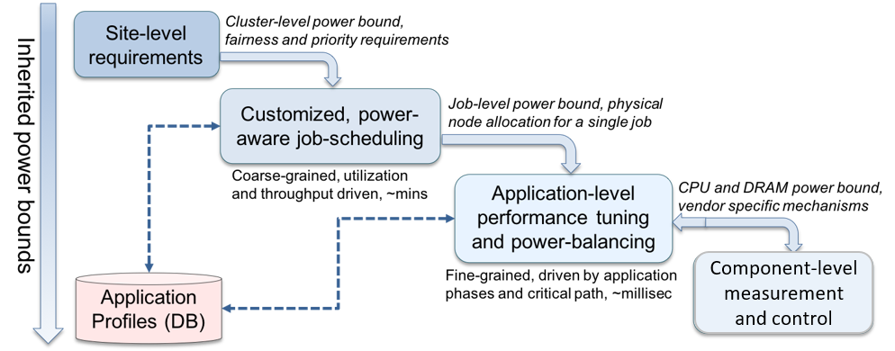

## Background

The landscape of high-performance computing (HPC) is changing as we enter the exascale era. Power and energy management are key design points for the next generation of supercomputers. Efficiently utilizing procured power and optimizing performance of scientific applications under power and energy constraints is challenging due to several reasons, such as the dynamic phase behavior of applications, processor manufacturing variability, and increasing heterogeneity of node-level components. While several scattered research efforts to manage power and energy exist, a majority of these efforts are site-specific, require programmer effort, and often result in suboptimal application performance and system throughput. Additionally, these interfaces are not designed to cooperate or work together in an integrated manner, creating conflicts between various layers of a software stack. A holistic, generalizable and extensible approach to power management is still missing in the HPC community. 

In this seminar, our goal is bring together experts from academia, research laboratories and industry in order to design a holistic and an extensible power management framework, which we refer to as the PowerStack. The PowerStack will explore hierarchical interfaces for power management at three specific levels: batch job schedulers, job-level runtime systems, node-level managers. Each level will provide options for adaptive management depending on requirements of the supercomputing site under consideration. Site-specific requirements such as cluster-level power bounds, user fairness, or job priorities will be translated as inputs to the job scheduler. The cluster-level job scheduler will choose power-aware scheduling plugins to ensure site-level compliance, with the primarily responsibility for allocation of nodes and job-level power constraints across multiple users and diverse workloads. Such allocations of physical nodes and job-level power bounds will serve as inputs to a fine-grained, job-level runtime system to manage specific application ranks, in-turn relying on vendor-agnostic node-level measurement and control mechanisms. Continuous monitoring and analysis of application behavior may be required for decision-making. The figure below presents an overview of the envisioned PowerStack, which takes a holistic approach to power management. 

 

 
Design and development of the PowerStack in a scalable, conflict-free and low-overhead manner presents several challenges. Some of these challenges, which will be discussed and defined extensively in the proposed seminary, are listed below:

*   Measurement and control mechanisms may use different underlying techniques (power capping versus frequency scaling) as well as different granularities (ranging from one millisecond to several hundred milliseconds) depending on the underlying node-level component and the vendor. How do we integrate data collected across different granularities? How do we decide on the granularities and frequencies of measurement and control? 
*   How do we compress, store and query measured application profile data? 
*   How do we expose a common vendor-neutral API to the job-level runtime system given the various underlying vendor-specific mechanisms?
*   How do we balance user priorities, fairness and charging requirements when maximizing for better utilization and throughput in job schedulers?
*   How do we ensure safe operation and trust among the management levels? How do we resolve conflicts while ensuring safe operation?
*   How do we define the communication protocol across these levels? 
*   How do we address the security aspects of such a power stack? What levels of measurement and control should be exposed to the application developer and the users?
