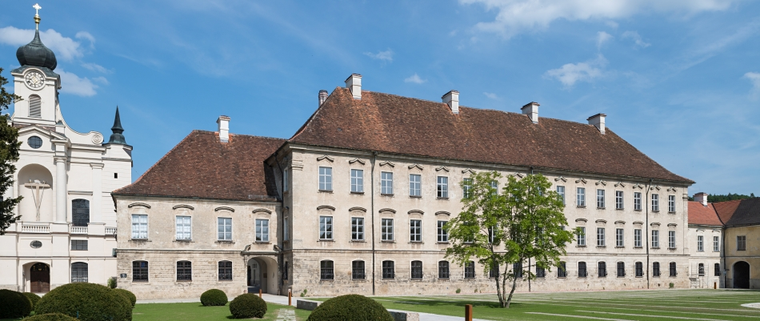

## Welcome to the HPC PowerStack Seminar

The Raitenhaslach Seminar on "The HPC PowerStack: Enabling Efficient Power Management in High-Performance Computing through Hierarchical Design" will bring together experts from academia, research laboratories and industry in order to design a holistic and extensible power management framework, which could ultimately lead to standardization or - at least - homogenization efforts for this important piece of the HPC software stack. Power and energy management are important thrust areas for the next generation of supercomputers and present several optimization challenges. The PowerStack will explore hierarchical interfaces for power management at three specific levels: batch job schedulers, job-level runtime systems, node-level managers.

## Venue

The backdrop for this seminar will be the new <a href="https://www.raitenhaslach.tum.de/en/home/">Science and Study Center</a> of the <a href="https://www.tum.de/nc/en/homepage/">Technical University of Munich (TUM)</a>.
Nestled in the beautiful Bavarian landscape flanking the river Salzach, the former Cistercian monastery Raitenhaslach exudes inspiration and historical charm. After extensive restoration work, the monastery's late-baroque prelate's wing has been developed into a hub of international academic discussion.

Accomodations and the setting for evening discussions will be the nearby <a href="https://www.burghausen.de/">town of Burghausen</a>. The city is situated along the river Salzach and is home of the <a href="http://www.burg-burghausen.de/englisch/castle/bedeut.htm">worlds longest castle</a>, which sits on a ridge line above the city.

{::nomarkdown}

{:/}

## Impressions from Raitenhaslach

{::nomarkdown}

&nbsp;&nbsp;

&nbsp;&nbsp;

{:/}
