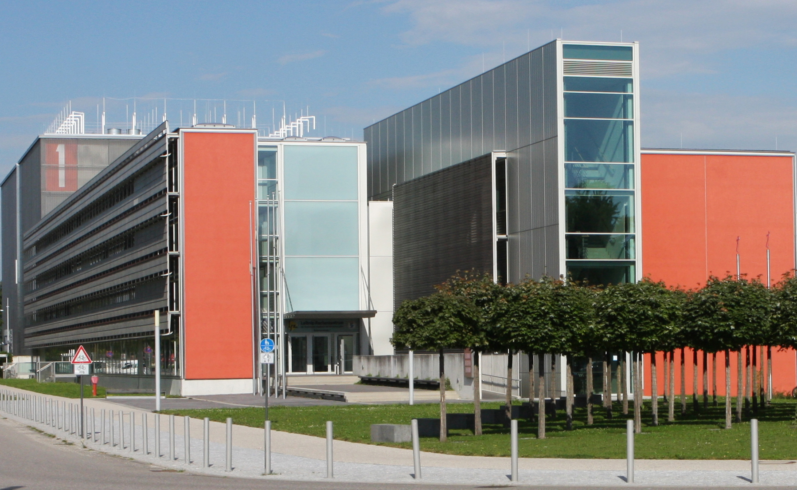

<h1 align="center">2nd Annual PowerStack Seminar</h1>

June 12-14, 2019

Leibniz-Rechenzentrum der Bayerischen Akademie der Wissenschaften 
Boltzmannstraße 1 
85748 Garching

## First Day Logistics
On the first day, please arrive to the main entry of LRZ by 8:45AM. We will
start the seminar at 9AM.

If arriving by train, stop at Garching-Forschungszentrum. If arriving by bus,
stop at Boltzmannstraße. From there, follow the paths to the LRZ computer center.
For more information, please see: [https://www.lrz.de/wir/kontakt/weg_en](https://www.lrz.de/wir/kontakt/weg_en).

In the main entry of LRZ, you will see signs guiding you to the reserved rooms
for the "PowerStack Seminar“ (the rooms are directly near the main entry).

## Agenda

The current agenda is below. There will be coffee breaks and on-site lunch
provided each day.

<table>
  <tbody>
    <tr>
      <th>Date/Time</th>
      <th>Goals</th>
      <th>Topics</th>
    </tr>
    <tr>
      <td>12.06.2019 Start Time: 9AM</td>
      <td>Recap previous year’s seminar and past year activities, ideas on
current implementations, working groups catch up on the status</td>
      <td>
        Morning (coffee break 11AM):
        <ul style="padding-left:20px">
          <li>Welcome and introduction of all attendees</li>
          <li>Current status report</li>
          <li>Comparison of existing layers and technologies: discuss implementation challenges, focus on interoperability with other layers of the stack</li>
        </ul>
        Lunch: 1PM  

        Afternoon (coffee break 3:30PM):
        <ul style="padding-left:20px">
          <li>WG-specific meetings: identify specific challenges within each
layer, review responses to questionnaire</li>
</ul>
        Planned Activity: Tour of LRZ Computer Facility
      </td>
    </tr>
    <tr>
      <td>13.06.2019</td>
      <td>Identify engineering challenges and discuss implementations of
interfaces among different layers of the software stack</td>
      <td>
        Morning:
        <ul style="padding-left:20px">
          <li>Updates from previous day's WG meetings</li>
          <li>Role of human actors in the stack (site/system admins &
end-users/app developers): site policies for accounting, application mark-ups</li>
        </ul>
        Afternoon:
        <ul style="padding-left:20px">
          <li>Interoperability between each WG: discuss inputs/outputs,
communication, privileges, responsibilities/ownership</li>
        </ul>
        Planned Activity: Seminar Dinner/Social Event (transportation provided)
      </td>
    </tr>
    <tr>
      <td>14.06.2019</td>
      <td>Determine commitments from each WG for a deliverable(s), identify
long-term directions</td>
      <td>
        Morning:
        <ul style="padding-left:20px">
          <li>Identify the next steps based on unresolved questions from Day 2</li>
          <li>Assign short-term tasks for WGs: identify stakeholders for
prototypes, tasks for post-seminar</li>
        </ul>
        Afternoon:
        <ul style="padding-left:20px">
          <li>Discuss long-term future directions of the PowerStack:
validation/compliance of PowerStack-compatible systems, incorporating
PowerStack designs within system procurement proposals</li>
        </ul>
      </td>
    </tr>
  </tbody>
</table>

## Lodging
Due to plenty of options around LRZ, we won't be blocking any hotel rooms for
the seminar (unlike last year). Please feel free to choose your own hotels.
Some pointers are listed below.

It is recommended to choose a hotel in:
* Garching (such as "Hotel Hoyacker Hof“, "Hotel König Ludwig II.“ or cheaper "Ibis Budget" or "Motel One“), OR
* Munich city centre (multiple hotel options here)

## Invitation
The Raitenhaslach Seminar on "The HPC PowerStack: Enabling Efficient Power
Management in High-Performance Computing through Hierarchical Design" was held
from June 20-22, 2018 in Raitenhaslach, Germany. Continuing from last year, we
are organizing the Second Annual PowerStack Seminar to continue this effort
forward. While the monastery location from last year is not available this
time, we would still like to stick with the same geographic area. And so, this
year, the Leibniz Supercomputing Centre (LRZ) in Munich has graciously offered
to host us.

While we have not been able to spin up the working groups to the extent we had
hoped, the overall initiative has gained steady and significant traction across
members of the labs, vendors, and academia. In accordance to this, we would
like to organize a second face-to-face meeting -- with the hope of turning this
into an annual event -- for sharing status updates from all community partners,
revisiting unresolved research questions, continuing ongoing discussions on
software interoperability, and extending further collaborations across the
PowerStack community.

Some recent news: As you are aware, over the past quarter, the core committee
has been heads-down with event proposals for ISC and SC. While we are still
waiting for results of other submissions, we are happy to announce that the
ISC’19 committee has accepted our proposal for -- [“The First Annual Workshop
for HPC PowerStack”](isc19-workshop.html). Unlike
traditional workshops
that solicit paper submissions and include a series of back-to-back
presentations, this *full-day* workshop will be unique in that it will be
highly interactive. This will give us an opportunity to interact with and
obtain feedback from the broader external community attending the ISC
conference in Frankfurt from June 16-20, 2019.
** Note, however, that the ISC workshop mentioned above will *not* -- by any
means -- be a replacement of this more focused, hands-on, three-day,
face-to-face seminar scheduled the week prior to ISC @LRZ from June 12-14, 2019.
We hope that the dates for this seminar will make it convenient for many of you
who are planning on attending the conference as well.

Now that the back-to-back proposal deadlines are simmering down, we’d like to
resume our topic-specific working group discussions in the coming weeks. As a
reminder, there was a general consensus to split this collaboration into three
separate working groups -- each group contributing to a specific layer of the
stack. The exact structure for the face-to-face meeting would depend on how
much work we all get done over the coming months before June. In the upcoming
weeks, please expect further notifications about contributing to these groups.
In the meantime, we suggest subscribing to one or more of the mailing
lists/forums listed at the end of this email.

Once again, we hope that you’d join us all at the HPC PowerStack face-to-face
to continue our fruitful discussions (whilst enjoying the splendor of Bavaria
in the month of June). Please feel free to direct your RSVP to Sid Jana at
<siddhartha.jana@intel.com>.

Sincerely,

The HPC PowerStack core team
[ Martin Schulz (LRZ, TUM), Masaaki Kondo (RIKEN, Univ of Tokyo), Barry
Rountree (LLNL), Tapasya Patki (ECP, LLNL), Siddhartha Jana (EEHPC-WG, Intel),
Carsten Trinitis (TUM), Ryuichi Sakamoto (Univ. of Tokyo), Aniruddha Marathe
(LLNL), Jonathan Eastep (Intel), Christopher Cantalupo (Intel), Matthias
Maiterth (LMU, Intel), Josef Weidendorfer (TUM) ]

Please save the following dates
-- Date: June 12 (Wednesday) through June 14 (Friday), 2019
-- Venue: LRZ (Leibniz Supercomputing Centre) in Garching near Munich, Germany.
-- Registration fee for covering the daytime food expenses: Around 100 Euros total for all three days

## Registration
To RSVP, please email Sid Jana at <siddhartha.jana@intel.com>.

The registration fee will cover on-site lunch for all three days, coffee
breaks, and a social event on June 13, 2019.

The registration link is live! Register
[here](https://interplan.eventsair.com/powerstack-2019/powerstack2019/Site/Register).

## Seminar Location
Leibniz-Rechenzentrum der Bayerischen Akademie der Wissenschaften 
Boltzmannstraße 1 
85748 Garching

## Getting to/from LRZ
* Google Maps does a pretty good job of capturing most of the transportation options</li>
* One can use the U-bahn (U6) for intra-city travel</li>
* [Here's](https://www.lrz.de/wir/kontakt/weg_en) another illustration

## Web resources to find a hotel
* [https://hotels.com](https://hotels.com)
* [Listing of accommodations in Garching](http://www.garching.de/Leben+in+Garching/Einkaufen+_+Übernachten/Übernachtungs_möglichkeiten.html)
* [Listing of accommodation in Munich](http://www.muenchen.de/uebernachten.html)

[Back](./)
