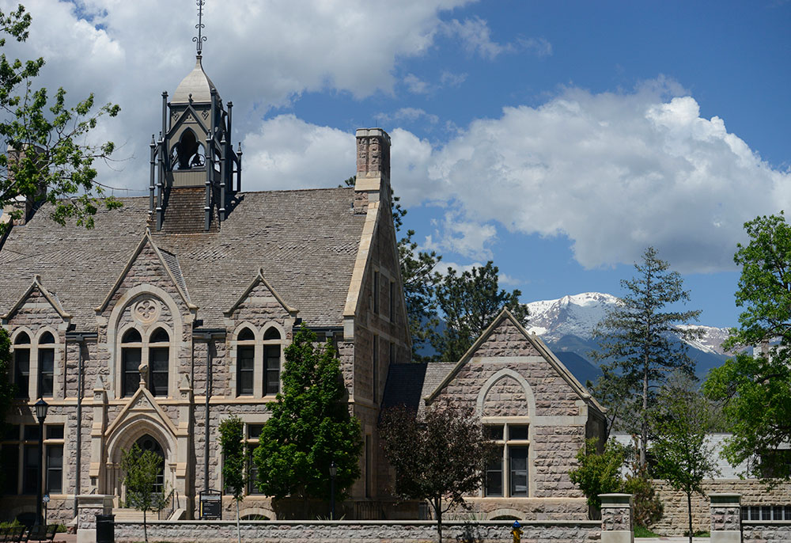

    

<h1 align="center">PowerStack Seminar</h1>

November 13-15, 2019 (Wed-Fri)

<b>Location</b> Worner Campus Center, Colorado College, 902 N Cascade Ave Colorado Springs, CO, USA 80903

<b>Registration Fee</b> $190 (includes daytime food expenses for all three days)

## First Day Logistics
On the first day, please arrive to the main entry of Worner Campus Center by 8:45AM. We will start the seminar at 9AM.

Shuttle service is provided between The Mining Exchange Hotel and Worner Campus Center. Pick-up on day 1 is scheduled at 8am on Pikes Peak Avenue. This will be the only morning pick-up time.

If you are planning to drive, then you may park on the street. There are no designated parking lots for visitors. A recommended parking spot is along the Tejon Street.

The seminar will be held in a lecture hall in the lower level of Worner Campus Center.

## Agenda
The seminar will start at at 9AM on Wednesday, November 13 and wrap-up around
3PM on Friday, November 15.

The current agenda is below. We will continue updating this during the week.
There will be coffee breaks and on-site lunch provided each day.

* <a href="https://docs.google.com/forms/d/e/1FAIpQLSd0HJrPFbrMMwEpJdIfx4LpHAEpsCy29fLb9L1zgLkio9riYA/viewform">Breakout Session Preference</a>
* <a href="https://powerstack.slack.com/signup">Join the PowerStack Slack Space</a>

<table>
  <tbody>
    <tr>
      <th>Date/Time</th>
      <th>Goals</th>
      <th>Topics</th>
    </tr>
    <tr>
      <td align="left">Nov-13-2019 Start Time: 9AM</td>
      <td align="left">Procurement and vendor discussions</td>
      <td align="left">
        <a href="https://docs.google.com/spreadsheets/d/1WGK1nAUDhYHLszKJnJPB9pi3MhvcNoBKsjx9I51RYAI/edit#gid=0">*Submit (or join) a Hackathon Project!</a>  

        Morning: 9AM (coffee break 10:30AM)
        <ul style="padding-left:20px">
          <li>Welcome and introduction of all attendees</li>
          <li>Current status report</li>
          <li>11AM: Group-wide discussion on identifying use cases.</li>
        </ul>

        Lunch: 12PM  

        Afternoon: (coffee break 3:30PM)
        <ul style="padding-left:20px">
          <li>1:00PM: Continue identifying use cases.</li>
          <li>2:30PM: Group breakouts: (1) procurements and (2) engineering.</li>
          <li>4:30PM: Recap day 1, give overview on plan for day 2. Identify hackathon projects and team members.</li>
        </ul>
        End: 5:15PM
      </td>
    </tr>
    <tr>
      <td align="left">Nov-14-2019 Start Time: 9AM</td>
      <td align="left">Hackathon</td>
      <td align="left">
        <a href="https://docs.google.com/spreadsheets/d/1WGK1nAUDhYHLszKJnJPB9pi3MhvcNoBKsjx9I51RYAI/edit#gid=0">*Submit (or join) a Hackathon Project!</a>  

        Morning: 9AM
        <ul style="padding-left:20px">
          <li>Community Updates</li>
            <ul>
              <li>Power Management on K Supercomputer</li>
              <li>GEOPM interoperability with RM</li>
              <li>Variorum</li>
              <li>ECP</li>
            </ul>
          <li>Take group photo.</li>
        </ul>

        Lunch: 12PM  

        Afternoon: 1PM
        <ul style="padding-left:20px">
          <li>Continue feedback on GEOPM interoperability with RM</li>
          <li>2:30PM-4:30PM Hackathon projects in small groups.</li>
          <li>4:30PM Recap of day 2.</li>
        </ul>
        End: 5PM
      </td>
    </tr>
    <tr>
      <td align="left">Nov-15-2019 Start Time: 9AM</td>
      <td align="left">Engineering and research</td>
      <td align="left">
        Morning: 9AM
        <ul style="padding-left:20px">
          <li>9AM-9:15AM Lightning presentations of hackathon projects.</li>
          <li>9:15AM-9:30AM Argo Updates</li>
          <li>9:30AM-11AM Discuss topics for upcoming calls, determine deliverables.</li>
          <li>(if time) Second breakouts (focus on interoperability between layers): (1) vendor/integrator and (2) research/evaluation</li>
        </ul>
        End: 12:15PM  
        Lunch  
        2PM Shuttle departs from Worner Center 
      </td>
    </tr>
  </tbody>
</table>

## Lodging
For your convenience, we have a hotel block at the Mining Exchange. Please use the following link to make your reservation at a discounted rate: <a href="https://www.wyndhamhotels.com/wyndham-grand/colorado-springs-colorado/the-mining-exchange-a-wyndham-grand-hotel/rooms-rates?brand_id=GR&checkInDate=11/12/2019&checkOutDate=11/15/2019&useWRPoints=false&children=0&groupCode=11136796CO&adults=1&rooms=1&radius=25&latitude=38.8338816&longitude=-104.8213634&sessionId=1568128670">Mining Exchange Room Block</a>.

Note: Part of the registration fee covers transportation between The Mining Exchange and Colorado College during the seminar.

## Travel
For those making travel arrangements to the seminar, we suggest flying into Denver International airport (DIA), which is 1.5 hours from Colorado Springs.

## Registration
Please register at this link <a href="https://coloradocollege.ungerboeck.com/prod/emc00/register.aspx?OrgCode=10&EvtID=37989&AppCode=REG&CC=119091703651">here</a>.

The registration fee covers costs associated with on-site lunch and coffee
breaks, transportation to/from hotel, room reservations, setup labor, equipment
rental, administrative fees, insurance, and registration-portal processing
fees.

## Seminar Location
Worner Campus Center, Colorado College 
902 N Cascade Ave. 
Colorado Springs, CO, USA 80903

<a href="https://www.coloradocollege.edu/basics/campus/directions/">Getting to Colorado College</a>

[Back](./)
