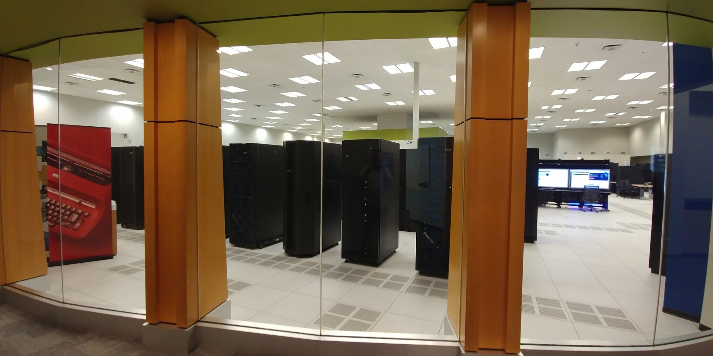

<b>THIS WILL BE AN IN-PERSON MEETING IN NOVEMBER 2022</b>
 
The PowerStack committee plans on organizing its annual seminar as a in-person. This structure has the additional benefit of including participants who have been unable to attend prior events due to travel restrictions. Like past years, we will schedule this event during the week prior to the SC conference (which will be located at Dallas).

The PowerStack seminar will be a two-day event on November 10th (Thurs) and November 11th (Fri), from 9am to 5pm (Central US Time - CST, UTC-6). 
We are quite hopeful that this will lead to more focused discussions.  The goal is provide updates from the working groups that had formed at the last seminar in November and to discuss the resulting documents and their next steps. Attendance will be free of charge. Registration link below 

Please feel free to reach out to the organizers if you'd like to invite additional participants.

Sincerely, 
The HPC PowerStack core-committee

<h1 align="center">PowerStack Seminar</h1>

November 10-11, 2022 (Thurs-Fri) In-person Event

The seminar on "The HPC PowerStack: Enabling Efficient Power Management in
High-Performance Computing through Hierarchical Design" will be held in-person in November 2022 (Nov 10-11). It will bring together experts from academia, research
laboratories and industry in order to design and engineer a holistic and
extensible, deployable power management framework.  Such a framework could
ultimately lead to standardization or - at least - homogenization efforts for
this important piece of the HPC software stack.

This is a closed meeting and seating is limited! If you are interested in attending, please reach out to one of the organizers know.

## Meeting logistics:

### <b>Agenda:</b> <a href="https://groups.google.com/g/powerstack-announce/c/eFhl9XzpIiA/m/cqFWPi2yBgAJ"> Day-1 Agenda </a>

### <b>Meeting link:</b> <a href="https://ibm.webex.com/meet/rosedahl"> For Remote Attendees </a>
-------------- | -------------
Phone Number   | +1-844-531-0958
Meeting Number | 926 262 403
Attendee #     | Just hit #

### <b>Venue:</b> IBM Innovation Studio, 1177 S Belt Line Rd, Coppell TX 75019

### Time: Each day, 9 am to 5 pm (CST, UTC-6)

### Shared drive for notes: <a href="https://drive.google.com/drive/folders/1QwVkTRtYYStt_hCNXNydCUzzm2luWJ26?usp=sharing"> Link for Nov'22 </a> (Includes notes from the working groups)

### Slack channel: <a href="https://powerstack.slack.com/"> Link </a>

### Group mailing list: <a href="https://groups.google.com/forum/#!forum/powerstack-announce"> Archive and subscription list </a>

### Accommodation: <a href="PS_2022_hotels.pdf"> List of nearby hotels </a>

### RSVP: <a href="https://forms.gle/4vS5tKEhxmREngq89"> Link </a>

[Back](./)
