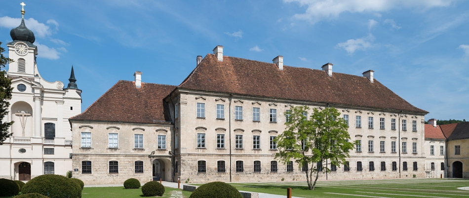

The Raitenhaslach Seminar on "The HPC PowerStack: Enabling Efficient Power Management in High-Performance Computing through Hierarchical Design" was held from June 20-22, 2018 in Raitenhaslach, Germany. A first-of-its kind seminar, it brought together experts from academia, research laboratories and industry in order to design and engineer a holistic and extensible, deployable power management framework. Such a framework could ultimately lead to standardization or - at least - homogenization efforts for this important piece of the HPC software stack. Power and energy management are important thrust areas for the next generation of supercomputers and present several optimization challenges. These experts are now a part of an active PowerStack team that is exploring hierarchical interfaces for power management at three specific levels: batch job schedulers, job-level runtime systems, node-level managers. 

The backdrop for this seminar was the new <a href="https://www.raitenhaslach.tum.de/en/home/">Science and Study Center</a> of the <a href="https://www.tum.de/nc/en/homepage/">Technical University of Munich (TUM)</a>. 
Nestled in the beautiful Bavarian landscape flanking the river Salzach, the former Cistercian monastery Raitenhaslach exudes inspiration and historical charm. After extensive restoration work, the monastery's late-baroque prelate's wing has been developed into a hub of international academic discussion. The nearby <a href="https://www.burghausen.de/">town of Burghausen</a> provided an ideal setting for evening discussions. The city is situated along the river Salzach and is home of the <a href="http://www.burg-burghausen.de/englisch/castle/bedeut.htm">worlds longest castle</a>, which sits on a ridge line above the city.

{::nomarkdown}

{:/}

## Impressions from Raitenhaslach

{::nomarkdown}

&nbsp;&nbsp;

&nbsp;&nbsp;

{:/}
