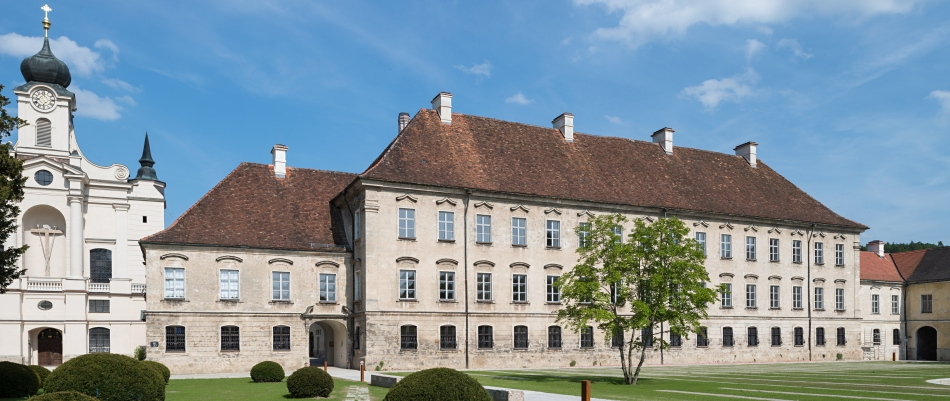

<b>THIS WILL BE A VIRTUAL MEETING IN JUNE 2020</b>
 
Due to recent COVID-19 challenges, the PowerStack committee plans on organizing
its annual mid-year seminar as a digital event instead of face-to-face. This
structure has the additional benefit of including participants who have been
unable to attend prior events due to travel restrictions. Like past years, we
will schedule this event during the week prior to the ISC conference (which is
also going digital).

The tentative dates for the PowerStack seminar will be June 17th (Wed) through
June 19th (Fri). Please mark these days on your calendars - a few hours each
day. The exact meeting timings will depend on the specific topic and the
time-zone of the attendees contributing to that topic. We are quite hopeful
that this will lead to more focused discussions. The final agenda will be sent
out in May. The current plan is to divide the three days and the time-slots
into different focus areas based on the ongoing working groups.

A note on our past plans from Nov’19 of having all the working groups sync in
April: The different teams have been meeting periodically since last December
and are making progress in their respective deliverables (literature survey,
white papers, software). Understandably, COVID-19 challenges and other
conference deadlines, their progress has been slow, but steady. In light of
recent events, we might just combine this pre-planned sync with our 3-day
seminar in June. This is TBD.

Please feel free to forward the news of our digital seminar to other
colleagues, as needed.

Sincerely, 
The HPC PowerStack core-committee

<h1 align="center">PowerStack Seminar</h1>

June 17-19, 2020 (Wed-Fri) Virtual Event

The seminar on "The HPC PowerStack: Enabling Efficient Power Management in
High-Performance Computing through Hierarchical Design" will be held digitially
in June 2020. It will bring together experts from academia, research
laboratories and industry in order to design and engineer a holistic and
extensible, deployable power management framework.  Such a framework could
ultimately lead to standardization or - at least - homogenization efforts for
this important piece of the HPC software stack.

If you are interested in attending, please let one of the organizers know.
More information to come in the coming months.

## Agenda

TBD

[Back](./)
