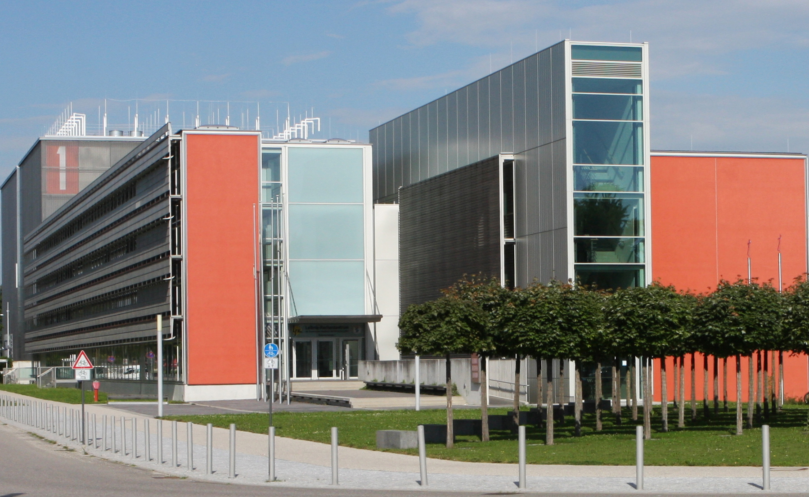

<h1 align="center">2nd Annual PowerStack Seminar</h1>

June 12-14, 2019

Leibniz-Rechenzentrum der Bayerischen Akademie der Wissenschaften 
Boltzmannstraße 1 
85748 Garching

<h2>Registration</h2>
To RSVP, please email Sid Jana <siddhartha.jana@intel.com>.

There will be a registration fee to cover the daytime food expenses for all
three days. Please check back for a registration link coming soon.

<h2>Lodging</h2>
Due to plenty of options around LRZ, we won't be blocking any hotel rooms for
the seminar (unlike last year). Please feel free to choose your own hotels.
Some pointers are listed below.

It is recommended to choose a hotel in:
<ul>
<li>Garching (such as "Hotel Hoyacker Hof“, "Hotel König Ludwig II.“ or cheaper "Ibis Budget" or "Motel One“), OR</li>
<li>Munich city centre (multiple hotel options here)</li>
</ul>

<h2>Invitation</h2>
The Raitenhaslach Seminar on "The HPC PowerStack: Enabling Efficient Power
Management in High-Performance Computing through Hierarchical Design" was held
from June 20-22, 2018 in Raitenhaslach, Germany. Continuing from last year, we
are organizing the Second Annual PowerStack Seminar to continue this effort
forward. While the monastery location from last year is not available this
time, we would still like to stick with the same geographic area. And so, this
year, the Leibniz Supercomputing Centre (LRZ) in Munich has graciously offered
to host us.

While we have not been able to spin up the working groups to the extent we had
hoped, the overall initiative has gained steady and significant traction across
members of the labs, vendors, and academia. In accordance to this, we would
like to organize a second face-to-face meeting -- with the hope of turning this
into an annual event -- for sharing status updates from all community partners,
revisiting unresolved research questions, continuing ongoing discussions on
software interoperability, and extending further collaborations across the
PowerStack community.

Some recent news: As you are aware, over the past quarter, the core committee
has been heads-down with event proposals for ISC and SC. While we are still
waiting for results of other submissions, we are happy to announce that the
ISC’19 committee has accepted our proposal for -- <a href="http://powerstack.lrr.in.tum.de/isc19.html">“The
First Annual Workshop for HPC PowerStack”</a>. Unlike traditional workshops
that solicit paper submissions and include a series of back-to-back
presentations, this *full-day* workshop will be unique in that it will be
highly interactive. This will give us an opportunity to interact with and
obtain feedback from the broader external community attending the ISC
conference in Frankfurt from June 16-20, 2019.

** Note, however, that the ISC workshop mentioned above will *not* -- by any
means -- be a replacement of this more focused, hands-on, three-day,
face-to-face seminar scheduled the week prior to ISC @LRZ from June 12-14, 2019.
We hope that the dates for this seminar will make it convenient for many of you
who are planning on attending the conference as well.

Now that the back-to-back proposal deadlines are simmering down, we’d like to
resume our topic-specific working group discussions in the coming weeks. As a
reminder, there was a general consensus to split this collaboration into three
separate working groups -- each group contributing to a specific layer of the
stack. The exact structure for the face-to-face meeting would depend on how
much work we all get done over the coming months before June. In the upcoming
weeks, please expect further notifications about contributing to these groups.
In the meantime, we suggest subscribing to one or more of the mailing
lists/forums listed at the end of this email.

Once again, we hope that you’d join us all at the HPC PowerStack face-to-face
to continue our fruitful discussions (whilst enjoying the splendor of Bavaria
in the month of June). Please feel free to direct your RSVP to Sid Jana
<siddhartha.jana@intel.com>.

Sincerely,

The HPC PowerStack core team
[ Martin Schulz (LRZ, TUM), Masaaki Kondo (RIKEN, Univ of Tokyo), Barry
Rountree (LLNL), Tapasya Patki (ECP, LLNL), Siddhartha Jana (EEHPC-WG, Intel),
Carsten Trinitis (TUM), Ryuichi Sakamoto (Univ. of Tokyo), Aniruddha Marathe
(LLNL), Jonathan Eastep (Intel), Christopher Cantalupo (Intel), Matthias
Maiterth (LMU, Intel), Josef Weidendorfer (TUM) ]

Please save the following dates
-- Date: June 12 (Wednesday) through June 14 (Friday), 2019
-- Venue: LRZ (Leibniz Supercomputing Centre) in Garching near Munich, Germany.
-- Registration fee for covering the daytime food expenses: Around 100 Euros total for all three days

<h2>Seminar Location</h2>
Leibniz-Rechenzentrum der Bayerischen Akademie der Wissenschaften 
Boltzmannstraße 1 
85748 Garching

<h2>Getting to/from LRZ</h2>
<ul>
<li>Google Maps does a pretty good job of capturing most of the transportation options</li>
<li>One can use the U-bahn (U6) for intra-city travel</li>
<li><a href="https://www.lrz.de/wir/kontakt/weg_en">Here's</a> another illustration</li>
</ul>

<h2>Web resources to find a hotel</h2>
<ul>
<li><a href="https://hotels.com">https://hotels.com</a></li>
<li><a href="http://www.garching.de/Leben+in+Garching/Einkaufen+_+Übernachten/Übernachtungs_möglichkeiten.html">Listing of accommodations in Garching</a></li>
<li><a href="http://www.muenchen.de/uebernachten.html">Listing of accommodation in Munich</a></li>
</ul>

[Back](./)
